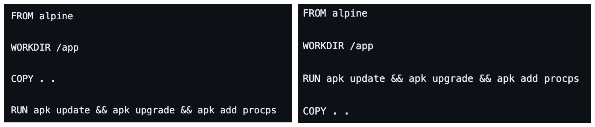

# 映像檔大小最佳化: 技巧 2 善用 Cache 機制



- Step 1: 用以下指令建構 image，觀察建構過程

```bash
docker image build -t lab:1.1 -f Dockerfile.1 .
docker image build -t lab:1.2 -f Dockerfile.2 .
```

- Step 2: 修改 a.txt 後，再建構一次，觀察過程的差異

---


