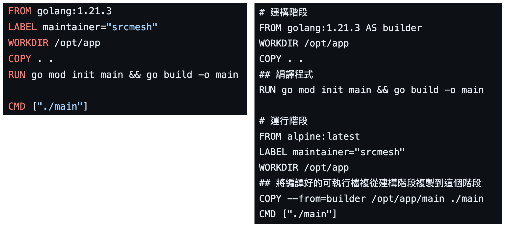

# 映像檔大小最佳化: 技巧 3 合併 RUN 指令



- Step 1: 用以下指令建構 image

```bash
docker image build -t lab:3.1 -f Dockerfile .
docker image build -t lab:3.2 -f Dockerfile.multi .
```

- Step 2: 比較 image 的 Size

```bash
docker image ls
```
