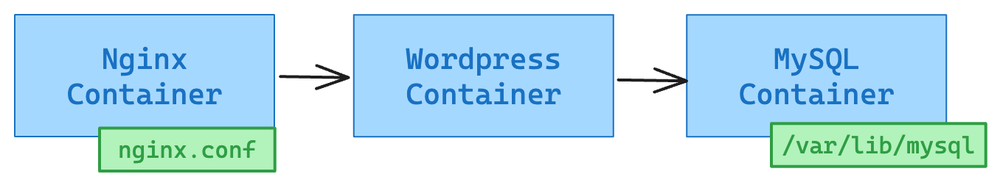

# Hands-on: Blog

請利用 `Nginx`、`Wordpress`、`MySQL` 來建立一個在 Docker 上運作的部落格網站。



## Container Image

- Nginx Image: https://hub.docker.com/_/nginx
  - 反向代理 (Reverse Proxy) 介紹: https://medium.com/starbugs/web-server-nginx-1-cf5188459108
- MySQL Image: https://hub.docker.com/_/mysql
- Wordpress Image: https://hub.docker.com/_/wordpress

## Configuration

### Nginx

- 設定檔放置位置: `/etc/nginx/nginx.conf`
- nginx.conf
  - 必須修正設定檔內兩處 `<backend-wordpress-svc-name>` 以便 Nginx 可以正確反向代理到 Wordpress

```
user  nginx;
worker_processes  1;

error_log  /var/log/nginx/error.log warn;
pid        /var/run/nginx.pid;

events {
    worker_connections  1024;
}

http {
    log_format  main  '$remote_addr - $remote_user [$time_local] "$request" '
                      '$status $body_bytes_sent "$http_referer" '
                      '"$http_user_agent" "$http_x_forwarded_for"';

    # Path to access.log & error.log
    access_log /var/log/nginx/access.log  main;
    error_log /var/log/nginx/error.log  warn;

    sendfile        on;
    keepalive_timeout  65;
    gzip  on;

    upstream backend {
        # must match the target service name
        server <backend-wordpress-svc-name>:80;
    }

    server {
        listen       80;
        location / {
            # $http_host is the host name that users seen on the browser URL
            # and it equals to `HTTP_HOST` request header.
            proxy_set_header Host $http_host;

            # You have to change this according to your setup.
            proxy_pass http://<backend-wordpress-svc-name>;

            # Modify `Location` of 301 or 302 HTTP response, so
            # that the browser will follow the correct location.
            proxy_redirect ~^http://[^/]*/(.*) http://$http_host/$1;
        }
    }
}
```

## 作業說明

利用 `Nginx`、`Wordpress`、`MySQL` 建立一個簡易部落格系統。

1. 透過 docker compose 來開發。

2. 讓 Nginx 做 reverse proxy 到 wordpress，而 wordpress 可以連結到 MySQL 來提供部落格服務

   - Container image 可以從上面 Dockerhub 連結取得
   - `wordpress`、`mysql` 需要用到的`環境變數`可在上面 Dockerhub 的網頁下方說明欄內找到

3. 為 Container 增加以下設定

   - `--cpus` 與 `--memory` 限制
   - 健康檢查機制
     - 請思考如何偵測 Nginx、Wordpress、MySQL 是否正常運作
     - Nginx, Wordpress: `curl -f http://localhost:80`
     - MySQL: `mysqladmin ping -h localhost -u root --password=examplepass`
   - 思考 Container 之間的依賴關係怎麼設定

4. 為 Container 增加以下設定

   - 適當的 restart policy
   - 透過 GELF log driver 將 Container 的 access log 輸出到 Graylog

5. 當完成後，你應該要能夠:
   - 使用 port mapping 看到透過 nginx 看到 wordpress 畫面，並且能正常儲存 blog 文章
   - 在 Graylog 看到 Container 的 log

## Docker Compose 範例

```
services:
  foobar:
    image: foobar:latest
    container_name: foobar
    volumes:
      - ./xxxxx.conf:/some/path/zzzz.conf
    ports:
      - 'xxxx:yyyy'
    depends_on:
      - foo
    healthcheck:
      test: ['CMD-SHELL', 'curl -f http://localhost || exit 1']
      interval: 30s
      timeout: 10s
      retries: 3
    restart: unless-stopped

  foo:
    image: foo:8
    container_name: db
    environment:
      ENV: VAL
    volumes:
      - <volume-name>:<mount-path>
    restart: unless-stopped

volumes:
  <volume-name>:
```

Logging 與 Healthcheck 寫法

```
services:
  foobar:
    ....
    logging:
      driver: gelf
      options:
        gelf-address: udp://127.0.0.1:12201
    healthcheck:
      test:
        [
          'CMD-SHELL',
          '<health-check-command> || exit 1',
        ]
      interval: 30s
      timeout: 10s
      retries: 3
```


## 繳交方式

請至 https://github.com/srcmesh-workshop/docker-workshop 開 Pull requests 繳交作業

## Tips

```bash
docker container run --name <container-name> -d \
  --log-driver=gelf \
  --log-opt gelf-address=udp://127.0.0.1:12201 \
  --log-opt tag="myweb" \
  -p 5566:80 \
  nginx:alpine
```
